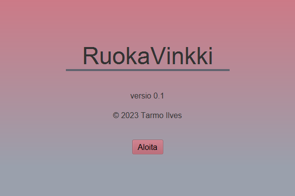
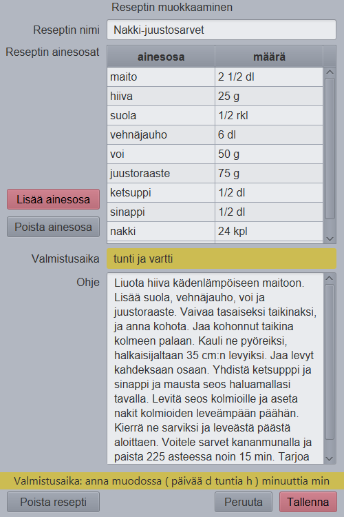

# RuokaVinkki - Tarmo Ilves
Ohjelmointi 2 syksyn 2023 harjoitustyö

Nimensä mukaisesti RuokaVinkki tarjoaa ideoita ruoanlaittoa varten. Ohjelmassa on mahdollista lisätä ja muokata ruoanlaittoreseptejä, ja toki myös poistaa tarvittaessa.

## Mitä tietoja tarvitaan?
- Reseptin nimi
- Reseptiin tarvittava aika
- Reseptin ohje
- Reseptiin tarvittavat ainesosat ja niiden määrät

## Mitä ominaisuuksia rekisteriltä halutaan?
- Reseptin lisääminen
- Reseptin poistaminen
- Reseptihaku reseptin nimellä ja ainesosan nimellä
- Reseptien ja ainesosien muokkaaminen
- Ainesosien liittäminen resepteihin

## Tallennustiedostojen muoto
Ohjelman tiedot tallennetaan seuraavanlaisiin tekstitiedostoihin:
`data\reseptit.dat` - relaatiokannan päätaulu
```
; Kenttien järjestys tiedostossa
;r_id   |reseptin nimi |aika |ohje
1       |Nakki-juustosarvet |1 h 30 min |Liuota hiiva kädenlämpöiseen maitoon. Lisää suola, vehnäjauho, voi ja juustoraaste. Vaivaa tasaiseksi taikinaksi, ja anna kohota. Jaa kohonnut taikina kolmeen palaan. Kauli ne pyöreiksi, halkaisijaltaan 35 cm:n levyiksi. Jaa levyt kahdeksaan osaan. Yhdistä ketsupppi ja sinappi ja mausta seos haluamallasi tavalla. Levitä seos kolmioille ja aseta nakit kolmioiden leveämpään päähän. Kierrä ne sarviksi ja leveästä päästä aloittaen. Voitele sarvet kananmunalla ja paista 225 asteessa noin 15 min. Tarjoa lämpiminä. 
2       |Makaronimössö |30 min |Keitä makaronit ja paista jauheliha. Mausta jauheliha haluamallasi tavalla ja lisää tomaattimurska ja keitetyt makaronit. Anna ylimääräisen nesteen hieman haihtua ja syö lämpimänä. 
3       |Yrttivoipatonki |12 min |Laita uuni kuumenemaan 200 asteeseen. Ota yrttipatonki pakastimesta sulamaan. Laita leivinpaperi uunipellille, ja patonki päälle. Paista patonkia uunissa noin 12 min. Syö lämpimänä. 
4       |Mikropitsa |2 min |Laita mikropitsa mikroon täydelle teholle noin kahdeksi minuutiksi. Syö halutessasi lämpimänä tai toki mahdollista jääkaappikylmänäkin ilman mikrotusta.
```

`data\ainesosat.dat` - ainesosien luettelo
```
; Kenttien järjestys tiedostossa
;a_id   |ainesosan nimi
1       |maito
2       |hiiva
3       |suola
4       |vehnäjauho
5       |voi
6       |juustoraaste
7       |ketsuppi
8       |sinappi
9       |nakki
10      |kananmuna
11      |makaroni
12      |jauheliha
13      |tomaattimurska
14      |yrttivoipatonki
15      |mikropitsa
```

`data\reseptienainesosat.dat` - ainesosien liittäminen resepteihin relaation avulla
```
; Kenttien järjestys tiedostossa
;r_id   |a_id   |määrä
1       |1      |2 1/2 dl
1       |2      |25 g
1       |3      |1/2 rkl
1       |4      |6 dl
1       |5      |50 g
1       |6      |75 g
1       |7      |1/2 dl
1       |8      |1/2 dl
1       |9      |24 kpl
1       |10     |1 kpl
2       |11     |400 g
2       |12     |400 g
2       |3      |runsaasti
2       |13     |400 g
3       |14     |1 kpl
4       |15     |1 kpl
```

# Ohjelman käyttö
## Ohjelman käynnistys.
Ohjelma käynnistetään klikkaamalla ruokavinkki.jar-ikonia tai antamalla komentoriviltä komento
```
java -jar ruokavinkki.jar
```
Kun ohjelma käynnistyy, tulostuu näyttöön



## Pääikkuna
Kun ohjelma on käynnistynyt on näkyvillä ohjelman pääikkuna:


Pääikkunassa on seuraava menurakenne:
```
Tiedosto        Muokkaa                 Apua
========        =======                 ====
Tallenna        Lisää resepti...        Apua
Tulosta...      Muokkaa reseptiä...     Tietoja...
Lopeta
```

### Hakeminen
Pääikkunan vasemmassa reunassa näkyy Hakuehto.  Tästä
voi valita haluaako etsiä reseptejä ainesosan vai reseptin nimen perusteella.  Tämän jälkeen
tekstikenttään voi syöttää hakuehdon ja listaan tulee vain
ne reseptit joille haku toteutuu. Esimerkiksi jos kirjoitetaan hakuehtoon `suo`, niin haetaan kaikki reseptit joiden ainesosien nimissä on `suo` jossakin kohti.


Löytyneet reseptit lajitellaan valitun hakukentän perusteella.

### Muokkaaminen
Valittua reseptiä voidaan muokata joko painamalla muokkaa reseptiä -painiketta, tai valitsemalla pudotusvalikosta samaisen vaihtoehdon.


Jos valmistusaika kirjoitetaan väärässä muodossa, tulee tästä ilmoitus:



Tarvittaessa reseptin voi tämän ikkunan kautta myös poistaa. Painamalla poista resepti -nappia aukeaa varmistusikkuna ennen poistoa:


## Menutoiminnot yksityiskohtaisemmin
### Tallenna
Tallentaa kaikki muutokset.  Mahdollinen lisättävä resepti hyppää hakulistaan.

### Tulosta...
Avaa valitun reseptin tekstimuodossa, mikä mahdollistaa reseptin tulostamisen paperille.

### Lopeta
Tallentaa tehdyt muutokset, ja sulkee ohjelman.

### Lisää resepti...
Luo uuden reseptin, ja avaa muokkausikkunan.

### Muokkaa reseptiä...
Avaa valitun reseptin muokkausikkunaan, siis sama kuin yllä.

### Apua
Avaa selaimeen tämän ohjesivun.

### Tietoja...
Avaa ikkunan, jossa on mainittu tietoja ohjelmasta, esimerkiksi versio ja tekijä.


# CRC-kortit
## Resepti-luokka (Resepti)
```
|------------------------------------------------------------------------|
| Luokan nimi: Resepti                               | Avustajat:        |
|-------------------------------------------------------------------------
| Vastuualueet:                                      |                   |
|                                                    |                   |
| - Tietää reseptin kentät (r_id, nimi, aika, ohje)  |                   |
| - Osaa muuttaa 1|Nakki-juustosarvet|1 h 30 min...  |                   |
|   -merkkijonon reseptin tiedoiksi                  |                   |
| - Osaa antaa merkkijonona indeksin i kentän tiedot |                   |
| - Osaa laittaa merkkijonon indeksin i kentäksi     |                   |
|                                                    |                   |
|                                                    |                   |
|                                                    |                   |
|                                                    |                   |
|                                                    |                   |
|                                                    |                   |
|                                                    |                   |
|                                                    |                   |
|-------------------------------------------------------------------------
```

## Ainesosa-luokka (Ainesosa)
```
|------------------------------------------------------------------------|
| Luokan nimi: Ainesosa                              | Avustajat:        |
|-------------------------------------------------------------------------
| Vastuualueet:                                      |                   |
|                                                    |                   |
| - Tietää ainesosan kentät (a_id, aineossan nimi)   |                   |
| - Osaa muuttaa 1|maito -merkkijonon ainesosan      |                   |
|   tiedoiksi                                        |                   |
| - Osaa antaa merkkijonona indeksin i kentän tiedot |                   |
| - Osaa laittaa merkkijonon indeksin i kentäksi     |                   |
|                                                    |                   |
|                                                    |                   |
|                                                    |                   |
|                                                    |                   |
|                                                    |                   |
|                                                    |                   |
|                                                    |                   |
|                                                    |                   |
|-------------------------------------------------------------------------
```

## ReseptinAinesosa-luokka (ReseptinAinesosa)
```
|------------------------------------------------------------------------|
| Luokan nimi: ReseptinAinesosa                     | Avustajat:        |
|-------------------------------------------------------------------------
| Vastuualueet:                                      |                   |
|                                                    |                   |
| - Tietää reseptin ainesosan kentät (r_id, a_id,    |                   |
|   määrä)                                           |                   |
| - Osaa muuttaa 1|1|2 1/2 dl -merkkijonon reseptin  |                   |
|   ainesosan tiedoiksi                              |                   |
| - Osaa antaa merkkijonona indeksin i kentän tiedot |                   |
| - Osaa laittaa merkkijonon indeksin i kentäksi     |                   |
| - Yhdistää reseptin, ainesosan ja määrän           |                   |
|                                                    |                   |
|                                                    |                   |
|                                                    |                   |
|                                                    |                   |
|                                                    |                   |
|                                                    |                   |
|-------------------------------------------------------------------------
```

## RuokaVinkki-luokka (RuokaVinkki)
```
|------------------------------------------------------------------------|
| Luokan nimi: Ruokavinkki                        | Avustajat:           |
|-------------------------------------------------------------------------
| Vastuualueet:                                   |                      |
|                                                 | - Resepti            |
| - Huolehtii luokkien Reseptit, Ainesosat ja     | - Ainesosa           |
|   Reseptienainesosat välisestä yhteistyöstä ja  | - ReseptinAinesosa   |
|   välittää näitä tietoja pyydettäessä           | - Reseptit           |
|                                                 | - Ainesosat          |
|                                                 | - ReseptienAinesosat |
|                                                 |                      |
|                                                 |                      |
|                                                 |                      |
|                                                 |                      |
|                                                 |                      |
|                                                 |                      |
|                                                 |                      |
|                                                 |                      |
|-------------------------------------------------------------------------
```

## Reseptit-luokka (Reseptit)
```
|------------------------------------------------------------------------|
| Luokan nimi: Reseptit                              | Avustajat:        |
|-------------------------------------------------------------------------
| Vastuualueet:                                      |                   |
|                                                    | - Resepti         |
| - Pitää yllä rekisteriä, eli osaa lisätä ja poistaa|                   |
|   reseptejä                                        |                   |
| - Lukee ja kirjoittaa reseptit tiedostoon          |                   |
| - Osaa etsiä ja lajitella esim. reseptin nimellä   |                   |
|                                                    |                   |
|                                                    |                   |
|                                                    |                   |
|                                                    |                   |
|                                                    |                   |
|                                                    |                   |
|                                                    |                   |
|                                                    |                   |
|                                                    |                   |
|-------------------------------------------------------------------------
```

## Ainesosat-luokka (Ainesosat)
```
|------------------------------------------------------------------------|
| Luokan nimi: Ainesosat                             | Avustajat:        |
|-------------------------------------------------------------------------
| Vastuualueet:                                      |                   |
|                                                    | - Ainesosa        |
| - Pitää yllä rekisteriä, eli osaa lisätä ja poistaa|                   |
|   ainesosia                                        |                   |
| - Lukee ja kirjoittaa ainesosat tiedostoon         |                   |
| - Osaa etsiä                                       |                   |
|                                                    |                   |
|                                                    |                   |
|                                                    |                   |
|                                                    |                   |
|                                                    |                   |
|                                                    |                   |
|                                                    |                   |
|                                                    |                   |
|                                                    |                   |
|-------------------------------------------------------------------------
```

## ReseptienAinesosat-luokka (ReseptienAinesosat)
```
|------------------------------------------------------------------------|
| Luokan nimi: ReseptienAinesosat                 | Avustajat:           |
|-------------------------------------------------------------------------
| Vastuualueet:                                   |                      |
|                                                 | - ReseptinAinesosa   |
| - Pitää yllä rekisteriä, eli osaa lisätä ja     |                      |
|   poistaa reseptien ainesosia                   |                      |
| - Lukee ja kirjoittaa reseptien ainesosat       |                      |
|   tiedostoon                                    |                      |
| - Yhdistää reseptit, ainesosat ja määrät        |                      |
|                                                 |                      |
|                                                 |                      |
|                                                 |                      |
|                                                 |                      |
|                                                 |                      |
|                                                 |                      |
|                                                 |                      |
|                                                 |                      |
|-------------------------------------------------------------------------
```

## Näyttö-luokka (Naytto)
Tämä tulee käytännössä jakaantumaan useampaan luokkaan
```
|------------------------------------------------------------------------|
| Luokan nimi: Naytto                                | Avustajat:        |
|-------------------------------------------------------------------------
| Vastuualueet:                                      |                   |
|                                                    | - RuokaVinkki     |
| - Hoitaa kaiken näyttöön tulevan tiedon            |                   |
| - Hoitaa kaiken tiedon pyytämisen käyttäjältä      |                   |
|                                                    |                   |
|                                                    |                   |
|                                                    |                   |
|                                                    |                   |
|                                                    |                   |
|                                                    |                   |
|                                                    |                   |
|                                                    |                   |
|                                                    |                   |
|                                                    |                   |
|                                                    |                   |
|-------------------------------------------------------------------------
```

# Tietorakennekuva

